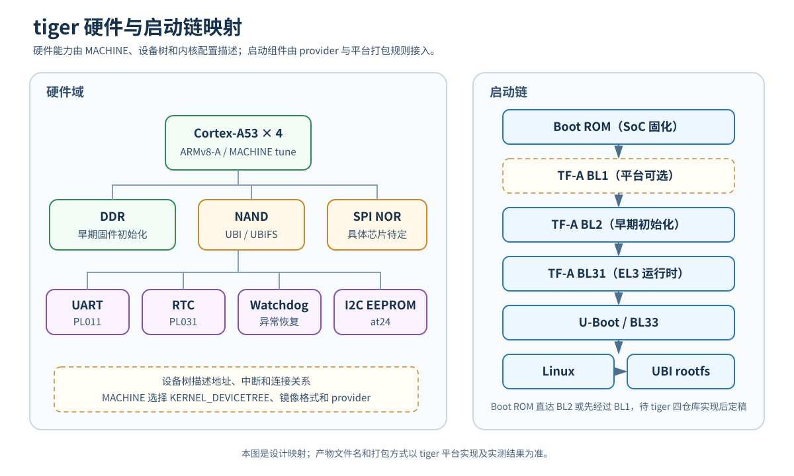
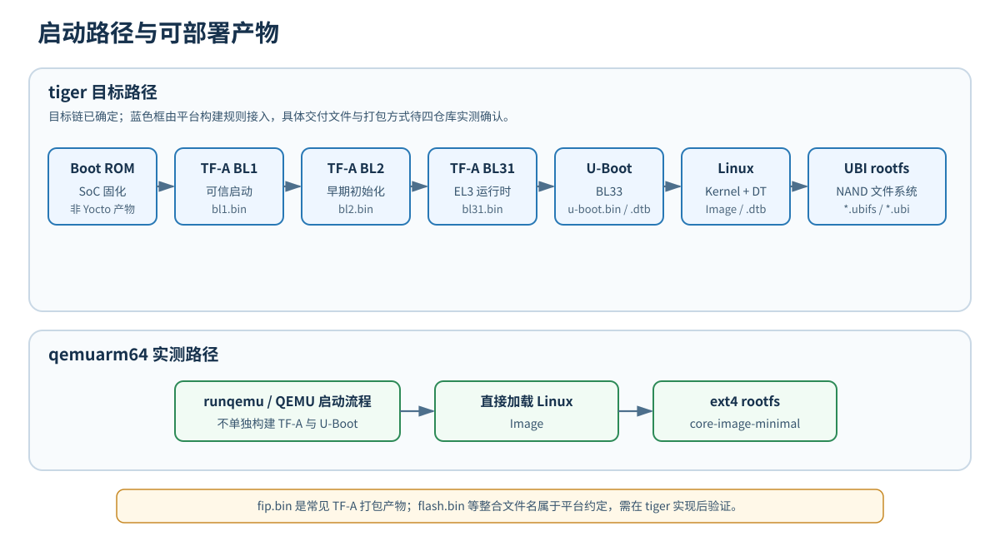
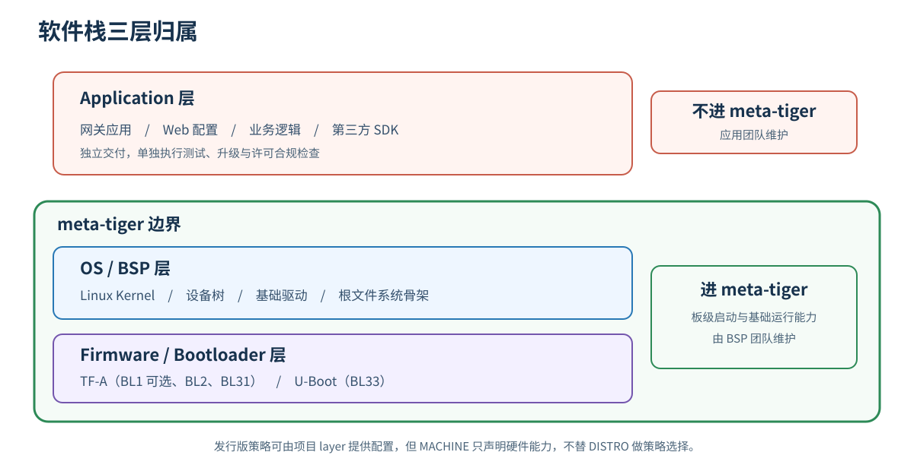
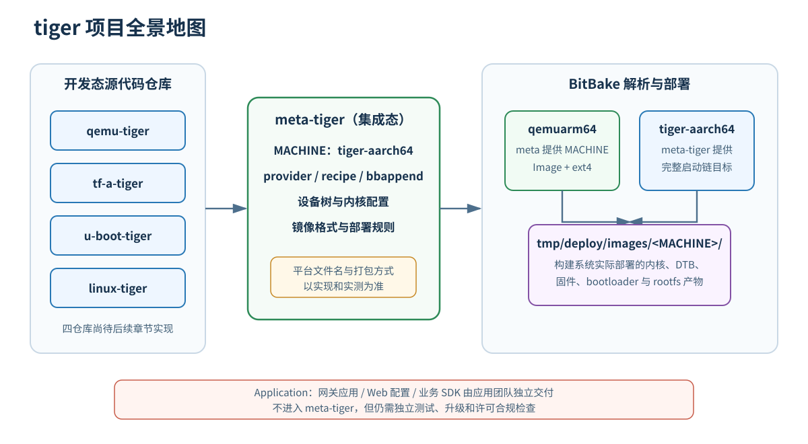

# 2 读懂这个项目

周二上午，阿凯一到工位就打开终端。昨天构建的 `core-image-minimal` 还在 `tmp/deploy/images/qemuarm64/` 里躺着。达哥打开本章随项目提供的硬件与启动链图，投到阿凯屏幕上。

“跑起来了？”达哥问。

“嗯，昨晚 `runqemu` 进了 shell。”阿凯回答。

“好。现在你打开 `poky` 仓库，告诉我你看到了什么。”

阿凯把窗口切过去，从上到下念：“`bitbake/`、`meta/`、`meta-poky/`、`meta-yocto-bsp/`……昨天翻过了。”

“光看目录没用。”达哥把 Fig-2-1 放大，“你接下来三个月做的所有事，都在这张图上。昨天你跑的是 `qemuarm64`——通用机器。今天我要你在这张图上找到 tiger 的每个零件，然后在 Poky 里指出它对应哪个目录、哪个 recipe。”

阿凯盯着图：**Cortex-A53**、**DDR**、**NAND Flash**、**SPI NOR Flash**、**UART**、**RTC**、**Watchdog**……旁边还画着从 Boot ROM 到 UBI rootfs 的启动链。“从哪开始？”

“从硬件。CPU、内存、Flash、外设——序章给你讲过了，现在你去 `meta` 里找一个真实 MACHINE 的配置，看看硬件是怎么描述给 Yocto 项目的。然后顺着启动链走，最后告诉我 tiger 的应用程序应该放哪。”

阿凯脱口而出：“放 `meta-tiger` 里？”

达哥没回答，把椅子转回去了。

**Fig-2-1 tiger 硬件与启动链映射**



## 2.1 tiger 硬件全貌的 Yocto 项目映射

阿凯先打开 Fig-2-1，又新开一个终端。他没有急着敲命令，而是把图上的每个硬件框都标上了序号：CPU、DDR、NAND Flash、SPI NOR Flash、UART、RTC、Watchdog、I2C EEPROM。

“这些框不是装饰，”他在心里提醒自己，“每个框在 Poky 里都得有人负责。”

`tiger` 和 `qemuarm64` 一样都是 ARMv8-A 64 位，先从最接近的参考 MACHINE 看起最省时间。阿凯先定位 `qemuarm64.conf` 的位置。

```bash
# 定位 qemuarm64 的 MACHINE 配置文件
find ~/workspace/poky -name "qemuarm64.conf"
```

输出：

```text
/home/oops/workspace/poky/meta/conf/machine/qemuarm64.conf
```

```bash
# 查看参考 MACHINE 配置的内容（只展示关键行）
cat ~/workspace/poky/meta/conf/machine/qemuarm64.conf
```

输出（关键行）：

```bitbake
#@TYPE: Machine
#@NAME: QEMU ARMv8 machine

require conf/machine/include/arm/armv8a/tune-cortexa57.inc
require conf/machine/include/qemu.inc

KERNEL_IMAGETYPE = "Image"
UBOOT_MACHINE ?= "qemu_arm64_defconfig"
SERIAL_CONSOLES ?= "115200;ttyAMA0 115200;hvc0"

# For runqemu
QB_SYSTEM_NAME = "qemu-system-aarch64"
QB_MACHINE = "-machine virt"
QB_CPU = "-cpu cortex-a57"
# ... (省略 QEMU 启动参数)
```

阿凯把这几行抄在便签上，逐条问达哥。

“`KERNEL_IMAGETYPE = "Image"` 是 **内核镜像类型（`KERNEL_IMAGETYPE`）**，指定内核编译产物格式。`Image` 是 AArch64 的未压缩内核镜像，tiger 也会用这个格式。”达哥指着屏幕，“`tune-cortexa57.inc` 是体系调优入口，tiger 用 Cortex-A53，后续会换对应的 tune 文件。”

“`SERIAL_CONSOLES` 呢？”

“串口控制台。`115200;ttyAMA0` 表示波特率 115200，设备节点 `ttyAMA0`。QEMU 的 **PL011** 串口模型会对应这个节点。tiger 的串口也是 PL011，到时候直接复用这个格式。`hvc0` 是 QEMU virtio console 的备用节点。”

“`qemu.inc` 里还有什么？”阿凯又问。

“`qemu.inc` 是 QEMU 机器的公共包含文件。”达哥打开文件，“里面设了 **机器特性（`MACHINE_FEATURES`）**、**镜像格式（`IMAGE_FSTYPES`）** 和内核提供者。注意 `MACHINE_FEATURES` 只描述硬件能力，不替发行版决定软件策略。”

```bitbake
# 文件路径：~/workspace/poky/meta/conf/machine/include/qemu.inc（关键行）
MACHINE_FEATURES = "alsa bluetooth usbgadget screen vfat"
IMAGE_FSTYPES += "tar.bz2 ext4"
PREFERRED_PROVIDER_virtual/kernel ??= "linux-yocto"
```

> **💡 提示**：`KERNEL_IMAGETYPE` 和 `IMAGE_FSTYPES` 本章只点到为止，后续写 `tiger-aarch64.conf` 时会再展开。

阿凯点点头，在图上把 `SERIAL_CONSOLES`、`MACHINE_FEATURES` 两个词标在 CPU/UART 旁边。然后他开始找外设在 Poky 里的对应位置。

```bash
# 在 linux-yocto 配方中查找 tiger 外设相关的内核特性配置
# PL011 UART、PL031 RTC、SPI NOR 子系统、at24 I2C EEPROM
find ~/workspace/poky/meta/recipes-kernel/linux/ -type f \( -name "*.scc" -o -name "*.cfg" \) | \
  xargs grep -l -E "pl011|pl031|spi-nor|m25p80|at24" 2>/dev/null
```

输出（示例，可能为空或仅匹配部分）：

```text
# 在 OE-Core 的元数据目录中，这些驱动关键字通常无直接匹配
# 它们随 linux-yocto 内核源码一起提供，位于下载后的内核源码树中
```

```bash
# 查找 NAND/UBI 用户空间工具对应的 recipe
find ~/workspace/poky/meta/recipes-devtools -name "mtd-utils*.bb"
```

输出：

```text
/home/oops/workspace/poky/meta/recipes-devtools/mtd/mtd-utils_git.bb
```

> **💡 提示**：`mtd-utils` 在 Scarthgap 中使用基于 git 的版本命名 `mtd-utils_git.bb`，以你本地文件名为准。

“PL011 UART 的 `amba-pl011.c`、PL031 RTC 的 `rtc-pl031.c`、I2C EEPROM 的 `at24.c` 都在当前 `linux-yocto` 内核源码里；SPI NOR 则由 `drivers/mtd/spi-nor/` 子系统负责。”达哥说，“如果以后选用 M25P80，`m25p80` 是芯片或设备树 `compatible` 标识，不是当前内核里一份独立的 `m25p80.c` 驱动。NAND 和 UBI/UBIFS 相关的用户空间工具由 `mtd-utils` 这个 recipe 提供。”

阿凯把结果填进一张表里，作为今天的第一个“地图坐标”。

**Table-2-1 tiger 硬件组件与 Yocto 项目位置对照**

| tiger 硬件组件 | 在 Poky/Yocto 项目中的对应位置 | 说明 |
|---|---|---|
| Cortex-A53 4 核 | `meta/conf/machine/include/arm/armv8a/tune-cortexa57.inc` | 体系调优入口（tiger 后续换 A53 对应 tune） |
| DDR | TF-A BL2（后续由 `meta-arm` 集成，后续章节引入） | 启动链中初始化内存 |
| NAND Flash + UBI | `meta/recipes-devtools/mtd/mtd-utils_git.bb` | UBI/UBIFS 工具集 |
| SPI NOR Flash | `linux-yocto` 的 `drivers/mtd/spi-nor/` 子系统 | 具体芯片和 `compatible` 待 tiger 硬件定型；M25P80 只能作为候选芯片/标识 |
| I2C EEPROM | `linux-yocto` 内核源码中的 `at24.c` | 板载 EEPROM |
| UART / PL011 | `linux-yocto` 内核源码中的 `amba-pl011.c` | `SERIAL_CONSOLES` 指定节点 |
| RTC / PL031 | `linux-yocto` 内核源码中的 `rtc-pl031.c` | 由设备树绑定 |
| Watchdog | `linux-yocto` 内核源码中的看门狗驱动 | 板载异常恢复 |
| 内核设备树 | **内核设备树（`KERNEL_DEVICETREE`）** 变量（`tiger-aarch64.conf` 中设置） | 指定编译哪些 `.dtb` |

“所以 tiger 不需要从零写所有驱动？”阿凯问。

“大部分通用外设驱动已经在 Linux 内核里，Poky 的内核 recipe 负责把它们纳入构建，后续引入的 `meta-arm` 可以提供 ARM 平台相关元数据。”达哥说，“我们要做的是：把 tiger 的地址、中断、引脚差异用设备树描述清楚，再用 **内核设备树（`KERNEL_DEVICETREE`）** 变量告诉内核要编译哪份设备树。”

## 2.2 启动链与构建产物对照

硬件坐标找完了，阿凯顺着 Fig-2-1 看启动链。这里必须先把两个概念拆开：**Boot ROM** 是 SoC 内固化的第一段代码，**TF-A BL1** 则是平台可以选择采用的可信固件阶段。tiger 最终是由 Boot ROM 直接交给 BL2，还是先经过 BL1，要等四个开发仓库的实现和实测定稿。之后的目标路径是 **TF-A BL2** → **TF-A BL31** → **U-Boot BL33** → Linux Kernel → **UBI rootfs**。

他先回忆昨天 `qemuarm64` 的 deploy 目录。

```bash
# 查看 qemuarm64 的构建产物
ls $BUILDDIR/tmp/deploy/images/qemuarm64/
```

输出（关键文件）：

```text
Image
core-image-minimal-qemuarm64.rootfs-<时间戳>.ext4
# ... (省略)
```

“`qemuarm64` 的关键产物里有 `Image` 和 rootfs，”阿凯自言自语，“却没有 tiger 启动链需要的 TF-A 和 U-Boot 产物。”

“对。”达哥凑过来，“`qemuarm64` 的 `runqemu` 配置让 QEMU 直接加载内核，没有单独构建板级 TF-A 和 U-Boot。tiger 的目标是复现真实板卡从固化启动代码到 TF-A、U-Boot、Linux 的完整流程；Boot ROM 之后是否采用 BL1，由平台方案决定。你现在要关心的是：Yocto 项目怎么选择 provider，又怎样按平台规则部署产物。”

阿凯想起昨天达哥说 BitBake 里有“虚包”机制。他尝试查看当前 MACHINE 下的 kernel 提供者。

```bash
# 确保已初始化构建环境
cd ~/workspace/poky
source oe-init-build-env ../build

# 在当前 MACHINE=qemuarm64 的构建环境下，查看虚拟 kernel 的提供者
bitbake -e virtual/kernel | grep PREFERRED_PROVIDER_virtual/kernel
```

输出（示例）：

```text
PREFERRED_PROVIDER_virtual/kernel="linux-yocto"
```

“这就是 **优先提供者（`PREFERRED_PROVIDER`）** 机制。”达哥指着输出，“`virtual/kernel` 是个虚拟目标，BitBake 允许多个 recipe 声称自己能提供 kernel。`PREFERRED_PROVIDER` 决定最终用谁。`qemuarm64` 的 kernel 由 `linux-yocto` 提供。”

“那 bootloader 呢？”阿凯问。

“QEMU 机器通常不设 `PREFERRED_PROVIDER_virtual/bootloader`，因为 QEMU 直接加载内核，不需要真实 bootloader。”达哥说，“但 tiger 会设。以后我们会写 `PREFERRED_PROVIDER_virtual/bootloader = "u-boot-tiger"`，还会加 `PREFERRED_PROVIDER_virtual/trusted-firmware-a = "trusted-firmware-a"`。这些现在只是前瞻，你先知道有这回事。”

阿凯先把两条启动路径画成 Fig-2-2，再把阶段和候选产物整理成 Table-2-2。

**Fig-2-2 tiger 与 qemuarm64 启动路径及构建产物对照**



**Table-2-2 启动阶段与候选构建产物对照**

| 启动阶段 | 负责组件 | Yocto 项目产物文件 | qemuarm64 是否有 |
|---|---|---|---|
| Boot ROM | SoC 出厂固化 | 不由 Yocto 项目构建 | 不单独产出，由 QEMU 启动流程替代 |
| TF-A BL1（平台可选） | Trusted Firmware-A | 采用时可能部署 `bl1.bin`，以平台规则为准 | 无 |
| TF-A BL2 | Trusted Firmware-A | 可能部署 `bl2.bin`，以平台规则为准 | 无 |
| TF-A BL31 | Trusted Firmware-A | 可能部署 `bl31.bin`，以平台规则为准 | 无 |
| BL33 (U-Boot) | U-Boot | 可能部署 `u-boot.bin` / `u-boot.dtb`，以平台规则为准 | 无 |
| Linux Kernel | linux-yocto / linux-tiger | `Image`、设备树 `.dtb`；tiger 文件名待实现确认 | 有 `Image` |
| UBI rootfs | 镜像配方 | 配置后可能部署 `*.ubifs` / `*.ubi` | 实测为 `*.ext4` |

TF-A 常见打包产物还包括 `fip.bin`；`flash.bin` 等整合镜像名称属于具体平台约定。此时四个 tiger 开发仓库尚未实现，所以 Fig-2-2 和 Table-2-2 只记录设计目标，不把这些候选名称写成已经验证的交付承诺。后续以 MACHINE、provider、recipe 和平台打包规则实际部署到 `tmp/deploy/images/tiger-aarch64/` 的文件为准。

“现在明白为什么 `qemuarm64` 昨天一跑就通了吗？”达哥问，“因为 QEMU 替它吃了前半段启动链。 tiger 不行，前半段得我们自己一片片拼。”

## 2.3 软件栈分层与归属决策

硬件和启动链都串起来了，阿凯的注意力落到最上面一层：应用程序。达哥刚才没回答的问题还在他脑子里转。

“达哥，”阿凯转过身，“tiger 的网关应用程序、Web 配置界面——这些也写成 recipe 放进 `meta-tiger` 吗？”

达哥没有正面回答：“你昨天构建的 `core-image-minimal` 里有什么？”

“BusyBox、一些基础工具、内核、根文件系统……没有应用程序。”阿凯说。

“那你想想，如果我把 Web 后端、数据库、业务逻辑全塞进 `meta-tiger`，三个月后应用团队要更新一个功能，怎么办？”

阿凯迟疑了一下：“重新 `bitbake`？”

“重新 `bitbake` 会重跑受影响的软件任务并重新生成 rootfs 镜像，随后还要重做固件验证并更新相应的 license 清单。一个很小的 API 响应修改，不该被迫走完整固件发布流程。”达哥顿了顿，“所以 `meta-tiger` 只放 BSP 层的东西——让板子能启动、能跑内核、有基础文件系统。应用程序独立维护和交付。”

阿凯追问：“那 OTA 升级怎么做？”

“分成两条线。”达哥在纸上画了两条竖线，“BSP 更新走全量固件升级，周期长、验证重；应用更新走容器或独立包升级，轻量、快速。把它们分开，才能各按各的节奏走。”

“开源合规呢？”

“`meta-tiger` 里的组件越聚焦，BSP 的 license 清单越容易审计。自研闭源应用和第三方闭源 **软件开发工具包（SDK）** 即使独立交付，也仍要做各自的许可与合规检查；只是不要把它们混进 BSP 层的职责和清单。”达哥把笔放下，“长期维护也是同理。三年后别人接手 `meta-tiger`，他应该看到的是一块板子的 BSP，而不是你们公司的业务史。”

阿凯挠了挠头，把决策规则记进本子：

- **进 `meta-tiger`**：bootloader、kernel、设备树、基础驱动、根文件系统骨架、板级工具链配置。
- **不进 `meta-tiger`**：业务应用、Web 服务、UI 逻辑、产品配置、第三方闭源 SDK。

> **💡 提示**：可以把 BSP 想象成“房子的地基和水电”，应用是“装修和家具”。地基出问题整栋房子都危险，但换一盏灯不应该敲承重墙。

**Fig-2-3 软件栈三层归属图**



## 2.4 层（Layer）叠加机制

理解了软件栈归属，阿凯回头再看第一章启用的三个 layer。`bitbake-layers show-layers` 输出过：

```text
layer                path                                                                   priority
========================================================================================================
core                 /home/oops/workspace/poky/meta                                5
yocto                /home/oops/workspace/poky/meta-poky                          5
yoctobsp             /home/oops/workspace/poky/meta-yocto-bsp                     5
```

> **💡 提示**：第一列是各 layer 的 `BBFILE_COLLECTIONS` 名称（`core`/`yocto`/`yoctobsp`），不是目录名。这三个名称由对应 layer 的 `layer.conf` 中 `BBFILE_COLLECTIONS` 变量固定声明，不会随本地路径变化。

“它们为什么需要三个？”阿凯问。

“因为职责不同。”达哥说，“`meta` 是 OE-Core，提供通用 recipe、class、`qemuarm64` MACHINE 和 `core-image-minimal`；`meta-poky` 提供 Poky 的 DISTRO 策略；`meta-yocto-bsp` 提供其他官方参考板的 BSP。默认模板启用了三层，但构建 `qemuarm64` 并不依赖 `meta-yocto-bsp`。”

阿凯先验证哪个 recipe 由哪个 layer 提供。

```bash
# 确保已初始化构建环境
cd ~/workspace/poky
source oe-init-build-env ../build

# 查看 core-image-minimal 由哪个 layer 提供（默认输出：层名 + 版本号）
bitbake-layers show-recipes core-image-minimal
```

输出（关键行，示例）：

```text
=== Matching recipes: ===
core-image-minimal:
  meta                 1.0
```

“默认输出只显示层名和版本号。”达哥说，“想看完整路径，加 `-f`。”

```bash
# 查看 core-image-minimal 的完整文件路径
bitbake-layers show-recipes -f core-image-minimal
```

输出（关键行，示例）：

```text
=== Matching recipes: ===
core-image-minimal:
  /home/oops/workspace/poky/meta/recipes-core/images/core-image-minimal.bb
```

> **💡 提示**：`-f` 模式只输出文件路径，不输出层名 + 版本。以你本地实际输出为准。

“`core-image-minimal` 来自 `meta` 层。”阿凯说。

“对。基础镜像、基础包组一般在 OE-Core。`meta-poky` 更多是做发行版微调，比如默认启用哪些特性、用哪个 init 系统。”

达哥让阿凯再看 `DISTRO_FEATURES` 和 `MACHINE_FEATURES` 的当前取值，解释两者的区别：`DISTRO_FEATURES` 是 **发行版特性（`DISTRO_FEATURES`）**，由 DISTRO 配置声明系统级策略，回答“这个发行版选择支持什么”。

```bash
# 确保已初始化构建环境
cd ~/workspace/poky
source oe-init-build-env ../build

# 查看当前 DISTRO、MACHINE 与两者交集特性
bitbake -e core-image-minimal | grep -E "^(DISTRO_FEATURES|MACHINE_FEATURES|COMBINED_FEATURES)="
```

输出（本章固化环境实测）：

```text
DISTRO_FEATURES="acl alsa bluetooth debuginfod ext2 ipv4 ipv6 pcmcia usbgadget usbhost wifi xattr nfs zeroconf pci 3g nfc x11 vfat seccomp opengl ptest multiarch wayland vulkan sysvinit pulseaudio gobject-introspection-data ldconfig"
MACHINE_FEATURES="alsa bluetooth usbgadget screen vfat rtc qemu-usermode"
COMBINED_FEATURES="alsa bluetooth usbgadget vfat"
```

“注意看，`DISTRO_FEATURES` 比 `MACHINE_FEATURES` 长很多。”达哥指着输出，“`MACHINE_FEATURES` 回答‘这块板子有什么’，`DISTRO_FEATURES` 回答‘这个发行版选择支持什么’。recipe 和 class 会按用途分别检查它们；`COMBINED_FEATURES` 给出两者共同支持的特性，所以实测只有 `alsa bluetooth usbgadget vfat`。它们共同影响构建结果，却不是简单拼成一张列表。”

“那如果两个 layer 都提供了同名的 recipe，BitBake 选哪个？”

“看 **层优先级变量（`BBFILE_PRIORITY`）**。”达哥打开 `bblayers.conf`，“同名 recipe 出现在不同 layer 时，数值更大的 layer 优先；这个优先级甚至高于 recipe 版本号。`BBLAYERS` 在这里声明启用哪些 layer，不要把它的排列顺序当成同名 recipe 的稳定选择规则。需要覆盖时显式设置层优先级、首选版本或提供者；普通变量和 `.bbappend` 另按各自规则解析。”

```bitbake
# 文件路径：~/workspace/build/conf/bblayers.conf（当前内容）
BBLAYERS ?= " \
  /home/oops/workspace/poky/meta \
  /home/oops/workspace/poky/meta-poky \
  /home/oops/workspace/poky/meta-yocto-bsp \
  "
```

> **💡 提示**：以上 `/home/oops` 路径取自配套固化构建环境（用户 `oops`、家目录 `/home/oops`、主机名 `tiger`）。

阿凯把各层职责整理成一张表。

**Table-2-3 Layer 职责对照**

| 构成角色 | Layer | 主要职责 | 与其他 layer 的关系 |
|---|---|---|---|
| 通用基础 | `meta` | OE-Core：通用 recipe、class、默认变量 | 提供公共基础 |
| 参考发行版 | `meta-poky` | Poky 发行版：DISTRO 策略、默认镜像微调 | 在 OE-Core 上定义发行版策略 |
| 参考 BSP | `meta-yocto-bsp` | 官方参考 BSP：其他参考板的 MACHINE 配置 | 提供可借鉴的板级实现；不是 `qemuarm64` 的必需层 |
| 项目 BSP（待添加） | `meta-tiger` | tiger 专用 BSP：`tiger-aarch64` 配置、启动链集成 | 新增 tiger 支持，按需扩展公共 recipe |

“所以要把 `meta-tiger` 加进 `BBLAYERS`，让 BitBake 看见 tiger 的 MACHINE 配置；确实需要替换同名 recipe 时，再显式设置优先级。”阿凯说。

“没错。”达哥点头，“它只负责 tiger 这台机器与众不同的部分，通用的东西留给公共 layer。”

## 2.5 认识镜像配方与 `IMAGE_INSTALL`

最后一块拼图是镜像本身。阿凯昨天构建的 `core-image-minimal` 为什么只有 BusyBox 和基础工具？他打开镜像配方的源码。

```bash
# 查看核心最小镜像的配方
cat ~/workspace/poky/meta/recipes-core/images/core-image-minimal.bb
```

输出：

```bitbake
SUMMARY = "A small image just capable of allowing a device to boot."

IMAGE_INSTALL = "packagegroup-core-boot ${CORE_IMAGE_EXTRA_INSTALL}"

IMAGE_LINGUAS = " "

LICENSE = "MIT"

inherit core-image

IMAGE_ROOTFS_SIZE ?= "8192"
IMAGE_ROOTFS_EXTRA_SPACE:append = "${@bb.utils.contains("DISTRO_FEATURES", "systemd", " + 4096", "", d)}"
```

“这就是 **镜像配方（Image Recipe）**。”达哥说，“它和普通 recipe 最大的区别是：普通 recipe 描述怎样构建并打包一个组件，image recipe 描述‘这个镜像里要装哪些包’。这里的 `inherit core-image` 会加载 `core-image.bbclass`，后者再继承 `image` 类，由此获得生成根文件系统镜像的能力。”

“`IMAGE_INSTALL` 就是安装列表？”阿凯问。

“对。`IMAGE_INSTALL` 是 **镜像安装列表（`IMAGE_INSTALL`）**，声明最终 rootfs 里要直接安装哪些包。`packagegroup-core-boot` 不是单个功能组件，而是一个 **包组（Package Group）**。”

阿凯继续追踪这个包组。

```bash
# 查看 boot 包组的内容
cat ~/workspace/poky/meta/recipes-core/packagegroups/packagegroup-core-boot.bb
```

输出（关键行）：

```bitbake
SUMMARY = "Minimal boot requirements"
DESCRIPTION = "The minimal set of packages required to boot the system"

inherit packagegroup

# Distro can override the following VIRTUAL-RUNTIME providers:
VIRTUAL-RUNTIME_dev_manager ?= "udev"
VIRTUAL-RUNTIME_keymaps ?= "keymaps"

EFI_PROVIDER ??= "grub-efi"

SYSVINIT_SCRIPTS = "${@bb.utils.contains('MACHINE_FEATURES', 'rtc', '${VIRTUAL-RUNTIME_base-utils-hwclock}', '', d)} \
                    modutils-initscripts \
                    ${VIRTUAL-RUNTIME_initscripts} \
                   "

RDEPENDS:${PN} = "\
    base-files \
    base-passwd \
    ${VIRTUAL-RUNTIME_base-utils} \
    ${@bb.utils.contains("DISTRO_FEATURES", "sysvinit", "${SYSVINIT_SCRIPTS}", "", d)} \
    ${@bb.utils.contains("MACHINE_FEATURES", "keyboard", "${VIRTUAL-RUNTIME_keymaps}", "", d)} \
    ${@bb.utils.contains("MACHINE_FEATURES", "efi", "${EFI_PROVIDER} kernel", "", d)} \
    netbase \
    ${VIRTUAL-RUNTIME_login_manager} \
    ${VIRTUAL-RUNTIME_init_manager} \
    ${VIRTUAL-RUNTIME_dev_manager} \
    ${VIRTUAL-RUNTIME_update-alternatives} \
    ${MACHINE_ESSENTIAL_EXTRA_RDEPENDS}"

RRECOMMENDS:${PN} = "\
    ${VIRTUAL-RUNTIME_base-utils-syslog} \
    ${MACHINE_ESSENTIAL_EXTRA_RRECOMMENDS} \
    ${@bb.utils.contains("DISTRO_FEATURES", "sysvinit", "init-ifupdown", "", d)} \
    ${@bb.utils.contains("DISTRO_FEATURES", "sysvinit pni-names", "ifupdown", "", d)} \
    "
```

“包组把一堆相关包组织成一个逻辑组，方便 image recipe 批量引用。”达哥说，“`${VIRTUAL-RUNTIME_base-utils}` 通常指向 `busybox`，`${VIRTUAL-RUNTIME_dev_manager}` 指向设备管理器。注意 Scarthgap 版本用了很多 `VIRTUAL-RUNTIME_*` 虚包和条件依赖——`sysvinit` 相关的脚本只在 `DISTRO_FEATURES` 包含 `sysvinit` 时才加入，`efi` 相关组件只在 `MACHINE_FEATURES` 包含 `efi` 时才加入。”

阿凯用 `bitbake -e` 查看最终生效的 `IMAGE_INSTALL`。

```bash
# 确保已初始化构建环境
cd ~/workspace/poky
source oe-init-build-env ../build

# 查看最终 IMAGE_INSTALL 的构成
bitbake -e core-image-minimal | grep ^IMAGE_INSTALL=
```

输出（示例，具体值因版本略有不同，以本地 `bitbake -e` 实际结果为准）：

```text
IMAGE_INSTALL="packagegroup-core-boot "
```

> **💡 提示**：示例输出以本地 `bitbake -e` 实际结果为准，此处保留尾部空格仅供参考。

“所以 `core-image-minimal` 不是‘一个配方编译出所有东西’，而是‘声明直接安装哪些包，BitBake 再解析它们的依赖’。”阿凯总结。

“正是。”达哥说，“等你写 `tiger-image-minimal.bb` 的时候，可以在 `IMAGE_INSTALL` 里加入 MTD 用户空间工具和调试工具。TF-A、U-Boot、内核这类启动链组件由 MACHINE 配置和 provider 选择，不是塞进 rootfs 安装列表。业务应用也按前面划定的边界独立管理。”

## 2.6 踩坑实录

### 2.6.1 踩坑 1：把所有东西都塞进 `meta-tiger`

阿凯在 2.3 节已经跟达哥讨论过这个问题，但那个教训值得再落一次地。

公司上代 Buildroot 项目就是把所有东西混在一起——bootloader、kernel、Web 应用、配置脚本、产品 logo 全塞在一个 `package/` 目录里。结果是：OTA 升级包体积巨大，每次升级都包含未改动的应用程序；license 审计时手动梳理了据说整整两周。

> **🔥 重要**：`meta-tiger` 不是“项目大杂烩”。它的边界是 BSP：让板子启动、让内核跑起来、提供基础根文件系统。业务应用、Web 服务、第三方闭源 SDK 应该由应用团队独立维护，BSP 只提供运行环境。

### 2.6.2 踩坑 2：混淆 MACHINE 配置和 DISTRO 配置

阿凯回看 MACHINE 与 DISTRO 的区别时，误以为机器配置也可以顺手决定发行版策略。他提出在 `qemuarm64.conf` 里写 `DISTRO_FEATURES += "systemd"`，达哥让他先备份文件，再用一次可恢复实验验证后果。

“`MACHINE_FEATURES` 描述硬件特性，比如 `apm`、`usbhost`、`screen`。`DISTRO_FEATURES` 描述系统策略，比如 `systemd`、`pulseaudio`、`wayland`。”达哥解释，“它们会分别被 recipe 和 class 检查；需要两边同时支持的特性才通过 `COMBINED_FEATURES` 取交集。职责边界很清楚：MACHINE 不该替 DISTRO 做策略决定。”

阿凯先备份配置，再在文件末尾增加一行：

```bash
# 仅用于可恢复实验：备份后追加越界配置
cp ~/workspace/poky/meta/conf/machine/qemuarm64.conf \
  ~/workspace/poky/meta/conf/machine/qemuarm64.conf.t012-backup
printf '\nDISTRO_FEATURES += "systemd"\n' >> \
  ~/workspace/poky/meta/conf/machine/qemuarm64.conf
```

然后跑 `bitbake -e` 验证：

```bash
# 确保已初始化构建环境
cd ~/workspace/poky
source oe-init-build-env ../build

# 触发配置解析与 provider 选择
bitbake -e core-image-minimal
```

输出（本章固化环境实测，命令返回码为 1）：

```text
ERROR: Nothing RPROVIDES 'udev' (but .../packagegroup-core-boot.bb RDEPENDS on or otherwise requires it)
ERROR: Required build target 'core-image-minimal' has no buildable providers.
```

“这一行语法能进入解析，但它只追加了 `systemd`，没有同步切换 Poky 的 init manager 和设备管理 provider。”达哥说，“结果是 `packagegroup-core-boot` 仍需要 `udev`，当前策略组合却找不到可构建的提供者。MACHINE 越界替 DISTRO 政策做决定，不仅难维护，还可能在 provider 选择阶段直接失败。”

阿凯意识到问题，立即用备份恢复，并检查工作树：

```bash
# 恢复实验前文件并确认没有遗留修改
mv ~/workspace/poky/meta/conf/machine/qemuarm64.conf.t012-backup \
  ~/workspace/poky/meta/conf/machine/qemuarm64.conf
git -C ~/workspace/poky status --short
```

`git status --short` 没有输出。然后重新验证：

```bash
# 确保已初始化构建环境
cd ~/workspace/poky
source oe-init-build-env ../build

# 正确做法：把 init 系统策略留给 Distro 配置
bitbake -e core-image-minimal | grep ^DISTRO_FEATURES=
```

输出（本章固化环境实测）：

```text
DISTRO_FEATURES="acl alsa bluetooth debuginfod ext2 ipv4 ipv6 pcmcia usbgadget usbhost wifi xattr nfs zeroconf pci 3g nfc x11 vfat seccomp opengl ptest multiarch wayland vulkan sysvinit pulseaudio gobject-introspection-data ldconfig"
```

> **⚠️ 注意**：写 `tiger-aarch64.conf` 时，只声明 tiger 这块板子有什么硬件；init 系统、网络策略、显示框架等属于 Distro 策略，留到 `tiger-distro.conf` 里决定。

## 2.7 本章小结

阿凯把今天学到的东西在脑子里过了一遍：

- **2.1**：tiger 的每个硬件组件在 Poky 里都有对应位置，通用外设大多已存在，重点是用 **内核设备树（`KERNEL_DEVICETREE`）** 把 tiger 的设备树指给内核。
- **2.2**：`PREFERRED_PROVIDER` 决定 BitBake 用哪个 recipe 提供虚包；构建系统控制的阶段是否部署、部署哪些文件，则由 MACHINE、provider、recipe 和平台打包规则共同决定。
- **2.3**：BSP 层和应用层必须分开，否则 OTA、合规、维护都会失控。
- **2.4**：Yocto 项目通过 layer 组织元数据，`meta-tiger` 将新增 tiger 的 MACHINE 配置，并按需扩展公共 recipe。
- **2.5**：镜像配方是声明式的，`IMAGE_INSTALL` 决定 rootfs 内容，包组用于批量组织相关包。

他把这些内容汇总成一张项目全景地图。图中的四个开发仓库和 tiger 产物仍是后续实现目标，当前已经实测的是 `qemuarm64` 参考路径。

**Fig-2-4 项目全景地图**



达哥看了一眼：“地图有了。下一步就是动手搭 `meta-tiger` 这个 layer。”

接下来的阅读路线：

- **第 3 章**：创建 `meta-tiger` 的骨架，让 BitBake 认识它。
- **第 4 章**：让 QEMU 长出 tiger 这块板。
- **第 5 章**：写第一份 MACHINE 配置。

> **💡 提示**：本章只“看”和“理解”，没有创建 `meta-tiger`、没有写 `tiger-aarch64.conf`、没有集成任何启动链组件。所有动手创建工作从下一章开始。
