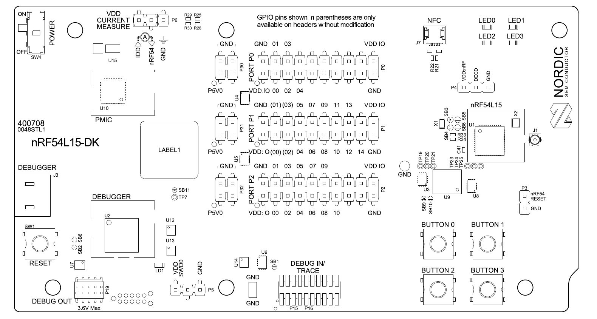

# 第 1 章 认识 nRF54L15 DK 与开发环境搭建

<!-- A-004 / ch-env-setup / v0.5 / writer / in_review / 2026-09-26。版本历史、评审与反馈记录见项目 TASKS.md。 -->

## 本章要解决的问题

本章从 nRF54L15 DK 和一台 Windows 主机开始。我们先认识板卡和芯片，再搭好开发环境，最后把第一个程序真正跑到芯片上。后续外设实验所需的传感器和执行器暂时都用不上。

读完本章并跟着做完实验后，你应该能够：

1. 说出 nRF54L15 SoC 的主要组成——Cortex-M33 应用核、FLPR RISC-V 协处理器、1.5 MB RRAM、256 KB RAM、电源域的概念，以及主要外设各自负责什么——并在 DK 实物上指出主芯片、天线、按键与 LED、USB 口、电流测量头的位置；
2. 在 Windows 主机上从零安装开发环境（VS Code → nRF Connect 扩展包 → Install SDK 安装 NCS v3.4.0 及配套工具链），准备调试驱动和烧录工具，并从扩展的工具链终端进行检查；
3. 基于官方示例创建工程，完成“构建 → 烧录 → 上板观察”的完整循环（blinky：LED 闪烁）；
4. 修改示例参数（闪烁周期）后重新构建烧录，确认自己掌控这个循环；
5. 说出官方资料——数据手册、DK 用户指南、Rev 2 勘误表、NCS 在线文档、DevZone——各自的用途，并能按板卡版本找到对应的勘误。

**前提**：本书假设你熟练使用 C 语言和系统编程、熟悉驱动与体系结构的概念（例如寄存器、中断、控制器），但此前没有接触过单片机、RTOS 和蓝牙。C 语言与寄存器原理本书不再讲解；遇到 Zephyr 特有的概念（本章会遇到 devicetree、Kconfig 的名字）我们会借助你的 Linux 内核背景作对照——正式讲解在第 2 章，本章只要求“会用”。

**所需资源**：一台 Windows 主机；nRF54L15 DK 1.0.0（板上为 Rev 2 芯片）；一条 USB-C **数据线**；可访问 Nordic 官网、VS Code 下载页和扩展市场的网络。安装前请检查磁盘余量和网络状况。

> **实践说明**：本章的安装、构建、烧录和上板步骤尚未在目标主机上完整执行。命令与预期结果依据 NCS v3.4.0 的固定版本文档编写；界面名称、安装路径、工具版本和日志措辞可能因实际环境略有差异。操作时请保存真实输出，遇到差异不要用本章的预期值覆盖它。

## 理解与实践

### 1.1 这块板子是什么

#### 1.1.1 先摸一遍实物

把 DK 拿在手里，先建立空间印象。以下是板上需要认识的位置（对照图 1-1）：



*图 1-1 nRF54L15 DK 正面布局。来源：Nordic Semiconductor，《nRF54L15 DK Hardware User Guide v1.0.0》，Figure 2。*

- **主芯片 nRF54L15**：板子中央那枚 QFN 封装的芯片，整块板子的主角。你写的程序最终就运行在它内部。
- **天线区**：板子边缘的 PCB 天线区域，2.4 GHz 射频信号从这里进出。蓝牙实验（第 11 章起）之前只需要知道它在哪里、不要用手遮挡即可。
- **按键与 LED**：4 个用户按键（Button 0–3）和 4 个用户 LED（LED 0–3）。它们是全书前半部分最主要的“输入输出设备”——本章的第一个程序就是让 LED 闪起来。
- **J3 USB-C 接口**：连接电脑后，它为 DK 供电，并承担烧录、调试和串口日志传输——这些功能都由板载调试器完成（见 1.1.3）。
- **电流测量头 P6**：一组排针，用于给芯片供电并串联电流测量。第 9 章做低功耗实验时会用到它，本章只需找到它的位置。
- **外接引脚排座**：板子两侧把芯片的主要 GPIO 引了出来，第 6 章起外接传感器和振动马达时会用到。

#### 1.1.2 打开芯片：nRF54L15 架构导览

现在把视野从板子缩到芯片内部。nRF54L15 是一颗多核、多电源域的 SoC，我们先建立一张“地图”（对照图 1-2），各部件只用一句话说明职责，细节留到对应章节展开。

> 【图 1-2 占位】nRF54L15 SoC 架构示意图：Cortex-M33 应用核、FLPR 协处理器、RRAM、RAM、2.4 GHz 射频、电源域和主要外设。

- **Cortex-M33 应用核（128 MHz）**：主处理器，你的应用程序默认运行在这里。它与你在 Linux 世界熟悉的“应用 CPU”角色相同——只不过这颗芯片没有 MMU，不存在用户态/内核态的地址空间隔离，程序直接运行在物理地址上。理解 RTOS 时我们会反复回到这个差异（第 3 章）。
- **FLPR RISC-V 协处理器**：一颗 128 MHz 的 RISC-V 小核，可以分担时序敏感的外设任务。本章只需要建立“芯片里还有一个协处理器”的印象；如何给它编程是进阶篇 ch-flpr-adv 的内容。
- **1.5 MB RRAM（阻变存储器）**：芯片的主存储器，相当于你熟悉的 Flash——程序烧录后就存放在这里。nRF54L15 用 RRAM 取代传统 NOR Flash，这在 Zephyr 里仍按 Flash 设备管理，第 16 章讲分区布局时会展开。
- **256 KB RAM**：运行时的内存。所有线程栈、堆、全局变量都在这 256 KB 里周转——没有交换分区可言，内存规划是嵌入式开发的日常（第 10 章）。
- **2.4 GHz 射频**：支持蓝牙低功耗（BLE）等 2.4 GHz 无线协议。本书主线是 BLE，从第 11 章开始正式使用。
- **电源域**：芯片内部划分了多个可以独立上下电的区域，这是 nRF54L15 低功耗设计的物理基础。本章只需知道“芯片能分区断电”这个概念，第 9 章结合电流测量展开。
- **主要外设清单**（各一句话，后面都有专章）：
  - GPIO / GPIOTE——引脚电平与事件，第 4 章；
  - UARTE——带 DMA 的串口，日志与调试的命脉，第 5 章；
  - TIMER / PWM——定时与波形输出，第 6 章；
  - TWIM（I2C）/ SPIM（SPI）——两条主力外设总线，第 7、8 章；
  - SAADC——模数转换，第 9 章；
  - RADIO、CRACEN（硬件加密）、GRTC（全局 RTC）、WDT（看门狗）等——随用随讲。

> 顺手澄清一个容易混淆的点：nRF54L15 **没有** I3C 控制器。网上涉及其他 nRF54 系列芯片的 I3C 资料并不适用于这块板，本书也不涉及 I3C。

#### 1.1.3 板载调试器：你的烧录器、调试器和串口线

DK 上除了 nRF54L15，还有一位隐形助手：**板载调试器**（J-Link OB，“OB”即 On-Board）。它在 J3 USB-C 接口与目标芯片之间，一片抵三件传统装备：烧录器、在线调试器（类似你熟悉的 JTAG）和 USB 转串口。后面的 `west flash` 命令、第 5 章的串口日志，以及本章可选的串口实验，都经由它完成。第一次连接时，如果工具提示升级板载调试器固件，按界面指引完成即可；没有提示则直接继续。

DK 的 VDD（IO 电平）默认为 1.8 V。本章不连接任何外接模块，无需调整；等第 7 章接传感器之前，我们才会用到配套的 Board Configurator 工具检查电平设置。

### 1.2 开发环境长什么样

动手安装之前，先看一张“要装哪些东西、各自管什么”的地图（对照图 1-3）。嵌入式工具链名词繁多，先把角色分清，安装时就不会迷失。

图 1-3 开发环境组成示意（作者自制，表示工具职责，不是实机截图）：

```text
Windows 主机
├─ VS Code + nRF Connect 扩展包：安装 SDK、编辑、构建与调试入口
│  ├─ Install SDK → NCS v3.4.0 源码 + 配套工具链
│  └─ nRF Connect 工具链终端 → west → 构建 / 默认 nrfutil runner
│     └─ 工具链捆绑 nRF Util + device 命令
├─ SEGGER J-Link 软件 + Windows USB 驱动 → 板载调试器 → nRF54L15
└─ 可选：nRF Connect for Desktop → Programmer（独立图形烧录界面）
```

- **Zephyr**：一个开源 RTOS（实时操作系统），由 Linux 基金会托管。它提供内核（线程、调度、同步、中断、定时）、设备驱动模型和大量协议栈。角色上可以对标你熟悉的 Linux 内核——只不过它面向没有 MMU 的微控制器，镜像通常只有几十到几百 KB。
- **NCS（nRF Connect SDK）**：Nordic 在 Zephyr 之上维护的官方 SDK，包含 Nordic 平台支持、协议栈、MCUboot 和示例。本书使用 **NCS v3.4.0**，其 Zephyr 基线为 4.4。日常说“装环境”，需要同时具备 SDK 源码和与它匹配的工具链。
- **west**：Zephyr 生态的命令行“大管家”，负责多仓库管理，并通过扩展命令衔接构建、烧录和调试。本章用 `west --version`、`west topdir` 和 `west boards` 检查命令、工作区与板列表，再用 `west build` 构建、`west flash` 调用烧录后端。对本书板级目标，默认 flash runner 是 **nrfutil**。
- **工具链**：编译器、链接器、构建工具，以及 NCS 工具链捆绑的 nRF Util 与 `device` 命令。本章对应的 Zephyr SDK 为 1.0.1、GCC 为 14.3.0。源码、SDK、编译器、west、nRF Util 与 `device` 各自有独立版本，不能用其中一条输出代表整套环境。
- **默认烧录链**：`west flash` 默认选择 nrfutil runner，由工具链内的 nRF Util `device` 命令驱动烧录流程，并通过独立安装的 SEGGER J-Link 软件和 Windows USB 驱动访问 DK 的板载调试器。NCS v3.4.0 的板级文件先载入 nrfutil、再载入 jlink，因此默认项是 nrfutil；实际 runner 仍要对具体构建目录执行 `west flash --context` 核对。
- **nRF Connect for Desktop / Programmer**：独立的图形化工具箱与可选烧录界面，不是本章默认 CLI 烧录链的前置条件，也不承担本书版本的 SDK 安装入口。**Toolchain Manager 从 NCS v3.0.0 起不再提供新版本 SDK 和工具链安装**，不能用它安装 v3.4.0。[官方迁移说明](https://github.com/nrfconnect/sdk-nrf/blob/v3.4.0/doc/nrf/releases_and_maturity/migration/migration_guide_3.0.rst)
- **nRF Command Line Tools / nrfjprog（备选）**：该工具包已经归档；只有显式选择 `west flash -r nrfjprog` 时才需要。不要为了默认的 `west flash` 主线安装它，也不要让其中附带的旧 J-Link 覆盖已经安装的匹配版本。
- **VS Code 与 nRF Connect 扩展包**：本书的开发入口，负责 SDK 安装以及日常编辑、构建和调试。下面的 west 命令都在扩展配置的终端中运行。

还有两个名词本章只点名、不展开：**devicetree**（硬件描述，可借助你的 Linux 设备树经验理解，但使用方式存在差异）和 **Kconfig**（功能配置，同样源自 Linux 内核）。第 2 章剖析 blinky 工程时正式讲解；**DFU**（固件升级，本书第 16 章介绍 BLE 空中升级）则留到后面。

一个容易混淆的概念是**板级目标**（board target）：构建时告诉 west“为哪块板子的哪个核构建”。本书统一使用 `nrf54l15dk/nrf54l15/cpuapp`——读作“nRF54L15 DK 板 / nRF54L15 芯片 / 应用核”。写错一个字符，构建系统就会报错或生成错误的镜像，这是新手最常见的失败之一（Zephyr 官方板级文档亦以完整板级目标名演示构建，见“来源与延伸阅读”）。

### 1.3 动手安装（Windows 从零）

安装顺序是：**VS Code → nRF Connect 扩展包 → SDK 与配套工具链 → SEGGER J-Link 软件与 Windows 驱动 → 工具链终端检查**。其中 nRF Util 和 `device` 命令随 NCS 工具链提供，不需要另外安装。

安装目录建议使用不含空格和中文的路径，例如 `C:\ncs`。界面可能随扩展版本变化；找不到入口时先核对扩展版本，不要回退到 Toolchain Manager，也不要因为列表默认推荐其他版本而自行更换 v3.4.0。

#### 1.3.1 第一步：安装 VS Code 与扩展包

1. 从 [VS Code 官方下载页](https://code.visualstudio.com/download) 下载 Windows 安装程序，按主机情况选择用户或系统安装。
2. 打开扩展市场，安装 Nordic Semiconductor 发布的 **nRF Connect for VS Code Extension Pack**，完成其依赖扩展安装。
3. 打开左侧 nRF Connect 视图，进入 Welcome 页。

**预期成功现象**：扩展视图可以打开，首次安装时可看到 SDK 安装入口。记录 VS Code 与扩展版本；若扩展尚未启用，先处理安装提示，再继续。

> 【截图 1-1 待补】VS Code 的 nRF Connect Welcome 页及 Install SDK 入口。

#### 1.3.2 第二步：通过 Install SDK 安装 NCS v3.4.0

1. 在 Welcome 页选择 **Install SDK**，下载区域按网络条件选择。
2. 选择 **nRF Connect SDK**，再选择 **v3.4.0** 的 SDK 与工具链组合。仅安装工具链不会自动补齐 SDK 源码。
3. 按基线使用 `C:\ncs` 作为安装根目录，记录安装器实际显示的 SDK 路径；等待完成通知，并查看 Output 面板中的安装日志。

**预期成功现象**：扩展能列出已安装的 v3.4.0 SDK 与对应工具链，源码目录已经生成。若列表中没有 v3.4.0 或安装失败，保存完整提示，再按 [SDK 首次安装说明](https://docs.nordicsemi.com/r/bundle/nrf-connect-vscode/page/get_started/quick_setup.html/installing-sdk-and-toolchain-for-the-first-time?contentId=El7l02bgw~Jiewa~98anOw)排查。

下文以 `C:\ncs\v3.4.0` 为 SDK 路径示例；如果实际路径不同，后续命令和编辑路径要一起替换。目录树为示意，未经本机安装验证：

```text
C:\ncs\
├── toolchains\     ← 配套工具链
└── v3.4.0\         ← 本文示例中的 west 工作区根目录
    ├── .west\      ← west 工作区信息
    ├── zephyr\     ← Zephyr 源码与官方示例
    ├── nrf\        ← Nordic 组件与示例
    ├── bootloader\ ← MCUboot 等组件
    └── ...
```

SDK 源码目录和工具链目录用途不同；选择终端时两者的版本必须匹配。这个多仓库工作区由 west 管理，第 2 章再展开。

> 【截图 1-2 待补】扩展中 v3.4.0 SDK 与配套工具链安装完成的界面。

#### 1.3.3 第三步：准备默认烧录链

NCS v3.4.0 的默认命令行烧录路径是 **工具链捆绑的 nRF Util `device` 命令 + SEGGER J-Link 软件和 Windows USB 驱动**。按下面的职责关系准备，不要把多个烧录工具混成同一项：

1. 按 [NCS v3.4.0 安装文档](https://github.com/nrfconnect/sdk-nrf/blob/v3.4.0/doc/nrf/installation/install_ncs.rst)安装匹配的 **SEGGER J-Link Software and Documentation Pack**；在 Windows 上同时安装 SEGGER USB Driver for J-Link。如果安装程序要求重启，完成后重新打开 VS Code 与工具链终端。
2. 不要为默认烧录链另装一套 nRF Util。`device` 命令已经包含在 NCS 工具链中，下一节会用命令确认它能否调用。
3. **Programmer 是可选图形工具**。需要图形化识别或烧录时，可以安装 [nRF Connect for Desktop](https://www.nordicsemi.com/Products/Development-tools/nRF-Connect-for-Desktop) 及 Programmer；未安装 Programmer 不阻止本章使用默认的 `west flash` 命令链。
4. **nRF Command Line Tools / nrfjprog 仅作备选**。只有明确执行 `west flash -r nrfjprog` 时才需要已归档的 nRF Command Line Tools。本章不选择该 runner，日常命令也不加 `-r nrfjprog`。

**预期成功现象**：匹配的 J-Link 软件与 Windows 驱动安装完成，工具链终端可以调用 nRF Util 与 `device` 命令；连接 DK 后，`nrfutil device list` 能枚举目标设备。

#### 1.3.4 找到正确终端并检查环境

下面的命令只检查工具链和设备是否就绪；它们全部通过，也不代表应用已经构建或烧录成功。

1. 在 VS Code 中按 `Ctrl+Shift+P` 打开命令面板，执行 **`nRF Connect: Create Shell Terminal`**；也可从 nRF Connect 的 Welcome 页选择 **Open terminal**。终端可能沿用上次使用的 SDK 和工具链，须通过 **Pick Toolchain and SDK for nRF Connect Terminal** 选择 v3.4.0 及匹配工具链，再核对终端显示的版本。入口随扩展版本变化时，以[终端入口官方说明](https://docs.nordicsemi.com/r/bundle/nrf-connect-vscode/page/guides/extension_nrfconnect_profile.html/terminal-for-the-last-used-toolchain-and-sdk?contentId=IwzFNwle4i0Ds0KBOspH_A)为准。
2. 在该终端进入 SDK 工作区根目录。下文命令以 Windows PowerShell 为例；路径不同应先替换，不要在普通终端或串口会话中直接照抄：

   ```powershell
   cd C:\ncs\v3.4.0
   git -C nrf describe --tags --exact-match HEAD
   Get-Content zephyr\SDK_VERSION
   arm-zephyr-eabi-gcc --version
   west --version
   west topdir
   west boards | findstr nrf54l15dk
   nrfutil --version
   nrfutil device --version
   ```

3. 将实际输出与下面的期望值逐项比较：

   | 对象 | 期望值 | 这项检查能说明什么 |
   |---|---|---|
   | NCS manifest 仓库 | `nrf` 的精确标签为 `v3.4.0` | 当前 manifest 源码身份 |
   | Zephyr SDK | `zephyr\SDK_VERSION` 内容为 `1.0.1` | 被该 Zephyr 修订记录的 SDK 版本 |
   | GCC | 目标版本为 `14.3.0` | 工具链中的实际编译器版本；还要结合首次构建日志中的 `Found toolchain` 路径 |
   | west | 记录 `west --version` 的实际值 | 只证明 west 自身版本 |
   | nRF Util / `device` | 随 v3.4.0 工具链提供；分别记录两条命令的实际值 | 当前终端调用到的 nRF Util 主程序和 `device` 命令版本 |

4. 保存终端所选 SDK/工具链、SDK 路径和每条命令的完整输出。若 `git ... --exact-match` 因本地仓库没有标签而失败，或任何版本与期望不同，追加执行 `git -C nrf rev-parse HEAD`，保存路径、提交号和完整错误，再进行排查。
5. 连接 DK 后执行设备枚举：

   ```powershell
   nrfutil device list
   ```

   **预期检查点**：输出中出现当前 DK 的设备记录。没有枚举到设备时，先保存完整输出，再检查数据线、J-Link 软件与驱动以及板卡供电。

`west topdir` 应指向所选 SDK 工作区，板列表应出现 `nrf54l15dk` 相关项。列表中有板名、版本命令符合期望或设备能够枚举，都不等于完整目标已经构建或烧录通过；应用核目标与构建使用的实际编译器还要在 1.4 节核实。

> 【截图 1-3 待补】nRF Connect 工具链终端、所选版本与实际检查输出。这里的 shell 终端用于执行 west；1.4.3 的串口终端用于接收板子输出，二者不同。

只有上述检查实际通过后，才继续构建示例。请保留真实版本、路径和报错；这些记录会成为后续排查的起点。

### 1.4 第一个程序：blinky 上板

环境就位，现在把第一个程序跑上芯片。我们选用 Zephyr 官方示例 **blinky**——它是嵌入式世界的“Hello, World”：让一个 LED 周期性闪烁。这一步的目标不是理解代码（第 2 章剖析），而是**完整走一遍“创建工程 → 构建 → 烧录 → 观察”的循环**。

下面写的是应当看到的结果。只有你实际运行命令并观察到板上现象，才算完成实验。

#### 1.4.1 完整走一遍构建—烧录—观察循环

**第 1 步：选择 SDK 自带示例并创建构建目录**

沿用 1.3.4 节的 nRF Connect 工具链终端，确认选择的是 v3.4.0。下列命令使用 SDK 自带源码，不另外复制工程；先进入实际 SDK 根目录，示例路径不同则一并替换：

```text
cd C:\ncs\v3.4.0
west build -b nrf54l15dk/nrf54l15/cpuapp zephyr\samples\basic\blinky -d C:\ncs\build\blinky-first
```

逐段解释：

- `west build`：调用构建系统；
- `-b nrf54l15dk/nrf54l15/cpuapp`：板级目标（回忆 1.2 节的读法），**务必原样输入**；
- `zephyr\samples\basic\blinky`：示例源码相对 SDK 根目录的路径；
- `-d C:\ncs\build\blinky-first`：把构建产物放到 SDK 目录之外的独立目录，保持 SDK 源码干净。

**预期现象**：命令滚动输出 CMake 配置与编译日志，最终提示构建成功，产物位于 `C:\ncs\build\blinky-first\zephyr\` 下（`zephyr.elf` 等文件）。保存 CMake 日志中的 `Found toolchain` 路径与版本，并与 1.3.4 的 `arm-zephyr-eabi-gcc --version` 输出对照。

> 扩展也可以通过 “Create a new application” → “Copy a sample” 复制 blinky，再添加构建配置。但复制后的源码与构建目录会不同，不能与本节直接构建 SDK 自带示例的路径混用。本章以终端命令为主线，后续改参也沿用同一组路径。

**第 2 步：连接 DK**

用 USB-C **数据线**把 DK 的 J3 USB-C 接口连到电脑。第一次连接时：

- 工具可能提示**板载调试器固件升级**，按提示完成即可；
- Windows 会识别出 J-Link 相关设备。

在同一工具链终端再次执行 `nrfutil device list`，确认 DK 可以被枚举。

> 易错点：务必使用**数据线**。只能充电的 USB 线是“电脑完全不认识板子”的最常见原因。

**第 3 步：烧录**

先确认第 1 步实际构建成功、第 2 步识别到目标板，并已解决 1.3.3 节的烧录后端依赖。`-d` 必须指向刚才成功构建的目录。先只查看这个构建目录记录的 runner 上下文：

```text
west flash -d C:\ncs\build\blinky-first --context
```

**预期检查点**：输出的 available runners 包含 `nrfutil`，default runner 是 `nrfutil`。如果默认项或可用项不同，保存完整输出并停止烧录，先核对板级目标、构建目录和工具链；不要为绕过检查而直接改用另一 runner。

上下文符合预期后，再在同一工具链终端执行：

```text
west flash -d C:\ncs\build\blinky-first
```

**预期现象**：west 使用默认 nrfutil runner，经 nRF Util `device` 命令与 J-Link 访问 DK，写入镜像并复位芯片。不同工具版本的日志措辞可能不同，以实际输出为准。

> 如果出现 `readback protection`（读保护）报错，先保存完整日志核对原因。`--recover` 会擦除设备内容，不是日常烧录选项。只有确认目标板内容可以全部擦除时，才执行 `west flash -d C:\ncs\build\blinky-first --recover`。

**第 4 步：观察**

烧录完成后程序自动运行。

**预期现象**：DK 上与 blinky 示例对应的用户 LED 按固定节奏闪烁。默认程序每秒切换一次亮灭，即约亮 1 秒、灭 1 秒；具体灯号请以板级定义和实物为准。

当构建和烧录都成功，并且板上出现预期的闪烁时，这条 **源码 → 镜像 → 芯片 → 可观察行为** 的链路才算真正走通。只看到编译成功，还不能说明上板已经完成。

#### 1.4.2 修改闪烁周期：确认你掌控这个循环

只做一次不算掌控。现在改一个参数，重走一遍循环。

1. 用 VS Code（或任意编辑器）打开 `C:\ncs\v3.4.0\zephyr\samples\basic\blinky\src\main.c`；
2. 找到定义闪烁间隔的宏 `SLEEP_TIME_MS`（默认值为 `1000`，单位毫秒），把它改成 `100`；
3. 在 1.3.4 节的工具链终端重新进入 SDK 根目录，再构建并烧录（路径按实际安装位置替换）：

   ```text
   cd C:\ncs\v3.4.0
   west build -b nrf54l15dk/nrf54l15/cpuapp zephyr\samples\basic\blinky -d C:\ncs\build\blinky-first
   west flash -d C:\ncs\build\blinky-first
   ```

**预期现象**：LED 闪烁明显变快（约每秒亮灭切换 10 次）。如果频率没有变化，检查：是否保存了文件？是否对同一个构建目录重新构建？烧录是否真的完成？

> 建议：改动 SDK 目录内的示例文件只是本章的权宜之计（方便起见直接在原示例上改）。从第 2 章开始，我们会把工程复制到独立目录再修改——这也是为什么上面的构建产物放在了 SDK 之外。

#### 1.4.3 可选实验：认识板载调试器的虚拟串口

板载调试器还提供了一路 USB 虚拟串口——目标芯片的 `printk`/日志经它送到电脑。提前认识它，第 5 章讲日志时就有了直观印象。

1. 在 1.3.4 节的工具链终端构建并烧录 hello_world 示例（同样须先完成烧录依赖检查）：

   ```text
   cd C:\ncs\v3.4.0
   west build -b nrf54l15dk/nrf54l15/cpuapp zephyr\samples\hello_world -d C:\ncs\build\hello-uart
   west flash -d C:\ncs\build\hello-uart
   ```

2. 打开串口终端（例如扩展包中的 nRF Terminal），选择 DK 枚举出的 COM 口，先使用 115200 8N1。这里不是执行 west 的 shell 终端；若没有输出或出现乱码，再核对示例配置、COM 口和串口参数；
3. 按一下 DK 上的复位键（或重新上电）。

**预期现象**：终端输出类似 `Hello World! nrf54l15dk/nrf54l15/cpuapp` 的一行文本——程序名与板级目标名都在里面。

### 1.5 出问题去哪查：官方资料地图

嵌入式开发离不开查资料，关键是知道**哪类问题应该去哪找答案**：

| 资料 | 管什么 | 什么时候翻它 |
|---|---|---|
| **nRF54L15 芯片数据手册** | 芯片的权威定义：寄存器、电气参数、外设行为 | 写驱动、查引脚、确认硬件能力 |
| **nRF54L15 DK 用户指南** | 这块**板子**的硬件：跳线、接口、供电、电流测量 | 接线、改供电、用 P6 测电流 |
| **勘误表（Errata）** | 芯片特定修订版的已知硬件缺陷与规避方法 | 现象与手册不符时，先查勘误再怀疑代码 |
| **NCS 在线文档**（docs.nordicsemi.com） | 安装指南、API 文档、示例说明、版本发布说明 | 装环境、查 API、看示例 |
| **Zephyr 官方文档**（docs.zephyrproject.org） | Zephyr 内核与驱动 API、板级支持列表、west 手册 | 查 Zephyr 层的一切 |
| **Nordic DevZone** | Nordic 官方技术社区，工程师在线答疑 | 资料查不到的疑难杂症 |

**演示：按板卡版本查勘误。** 勘误表是按芯片修订版（revision）发布的，查错版本可能误导排查。本书的 DK 1.0.0 上焊接的是 **Rev 2** 芯片（丝印 nRF54L15-QFAAC00），对应的勘误表是 **Rev 2 Errata v1.1**。查法：在 Nordic 官网进入 nRF54L15 产品页 → Downloads/文档区 → Errata，选择与你芯片修订版一致的文件。芯片修订版可以从芯片丝印或 DK 用户指南中确认。

本书配套资料包的索引见 [nrf54l15-dk-docs/README.md](../../../../workspace/nrf54l15-dk-docs/README.md)，其中包含[数据手册](../../../../workspace/nrf54l15-dk-docs/nRF54L15_nRF54L10_nRF54L05_Datasheet_v1.0.pdf)、[DK 用户指南](../../../../workspace/nrf54l15-dk-docs/nRF54L15_DK_HW_User_Guide_v1.0.0.pdf)和[Rev 2 勘误表](../../../../workspace/nrf54l15-dk-docs/nRF54L15_Rev_2_Errata_v1.1.pdf)。查询时先核对适用的芯片修订版；不要用在线最新版自动替换当前硬件所需的资料。

把这张地图存好。后续章节会在需要时继续给出对应的官方资料入口。

## 回顾与自检

读完后先检查理解；实际完成实验后，再检查操作结果。不要把“看懂步骤”和“已经跑通”混为一件事。

- 你能否画出 nRF54L15 的简化架构图，并在 DK 实物上找到本章介绍的关键位置？
- 你能否说明 Zephyr、NCS、west、工具链和 VS Code 扩展各自负责什么？
- 如果已经动手，你是否真正走通了“构建 → 烧录 → 观察”，并通过修改闪烁周期验证了结果？
- 遇到硬件、安装或 Zephyr 问题时，你是否知道应当先查哪类官方资料？

**自检**（按解释、操作、变式三个层次，请如实记录自己的表现，不必全部做到）：

- 解释：不看 1.2 节，说出 NCS 与 Zephyr 是什么关系？west 在其中管什么？`nrf54l15dk/nrf54l15/cpuapp` 三段各指什么？
- 解释：数据手册、DK 用户指南、勘误表分别回答哪类问题？为什么查勘误要先确认芯片修订版？
- 操作：从 nRF Connect 工具链终端执行 1.3.4 的检查，说出各命令能验证什么、不能证明什么。
- 变式：把 blinky 的闪烁改成“快闪 5 次、停 2 秒”的节奏（提示：需要改动 main.c 里的循环结构而不只是宏）。做不到没关系——第 2 章剖析完工程结构后回来再试。
- 变式：在不查 1.5 节表格的情况下，回答“LED 不闪”时你会按什么顺序排查？（参考顺序：USB 是否数据线 → 板级目标是否写对 → 构建是否成功 → 烧录日志是否完成 → 勘误表。）

## 来源与延伸阅读

本章保留少量直接入口，便于安装和排查时回查：

- 芯片与板卡：[nRF54L15 数据手册](../../../../workspace/nrf54l15-dk-docs/nRF54L15_nRF54L10_nRF54L05_Datasheet_v1.0.pdf)、[DK 用户指南](../../../../workspace/nrf54l15-dk-docs/nRF54L15_DK_HW_User_Guide_v1.0.0.pdf)、[Rev 2 勘误表](../../../../workspace/nrf54l15-dk-docs/nRF54L15_Rev_2_Errata_v1.1.pdf)
- 环境安装：[NCS v3.4.0 安装文档](https://github.com/nrfconnect/sdk-nrf/blob/v3.4.0/doc/nrf/installation/install_ncs.rst)、[VS Code 扩展首次安装说明](https://docs.nordicsemi.com/r/bundle/nrf-connect-vscode/page/get_started/quick_setup.html/installing-sdk-and-toolchain-for-the-first-time?contentId=El7l02bgw~Jiewa~98anOw)
- 烧录工具：[NCS v3.4.0 编程文档](https://github.com/nrfconnect/sdk-nrf/blob/v3.4.0/doc/nrf/app_dev/programming.rst)、[nRF54L15 DK 板级配置](https://github.com/nrfconnect/sdk-zephyr/blob/ncs-v3.4.0/boards/nordic/nrf54l15dk/board.cmake)
- 板级目标与示例：[Zephyr nRF54L15 DK 文档](https://github.com/nrfconnect/sdk-zephyr/blob/ncs-v3.4.0/boards/nordic/nrf54l15dk/doc/index.rst)
- west 命令：[Zephyr west 内置命令文档](https://docs.zephyrproject.org/latest/develop/west/built-in.html)
- 继续学习：[Nordic DevAcademy](https://academy.nordicsemi.com/)

下一章将剖析本章使用的 blinky 工程：CMake 如何组织构建、devicetree 如何描述硬件、Kconfig 如何裁剪功能。届时，你的 Linux 内核设备树和 Kconfig 经验会派上用场。
